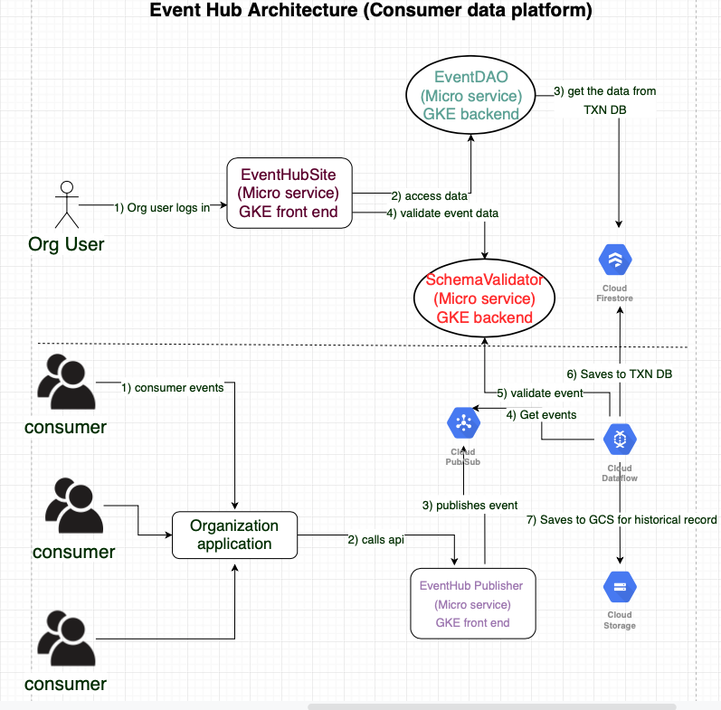

# Event Hub Site
This is a event hub web application(i.e., EventHubSite in the architure diagram) that lets the organization users to log in and manage the events, sources, targets, integrations and consumer profiles. This service is developed using SpringBoot MVC, Bootstrap CSS and Spring Thymeleaf.

## Running in local using Maven
mvn spring-boot:run -Dspring-boot.run.arguments=--spring.profiles.active=local

## Building docker
 mvn compile jib:dockerBuild

## Running docker in local
docker run -p 8080:8080 -e GOOGLE_CLOUD_PROJECT='event-hub-249001' -e "SPRING_PROFILES_ACTIVE=local" -t gcr.io/event-hub-249001/event-hub-site:0.0.1-SNAPSHOT

## Pushing to container registry
mvn clean compile jib:build

## Deploying to GKE
kubectl apply -f deployment

## Helm Deployments
### Plain Vanilla K8S Blue Green Deployment
#### Deployment to identical prod systems
helm upgrade --install --set image.tag=3e91cd82-059e-4f21-9a70-983fca43b7e3 --namespace prod event-hub-site-galaxy ./helm/blue-green-deploy/prod-galaxy 

helm upgrade --install --set image.tag=3e91cd82-059e-4f21-9a70-983fca43b7e3 --namespace prod event-hub-site-nebula ./helm/blue-green-deploy/prod-nebula 
#### Ingress to switch between two environments
kubectl apply -f galaxy-ingress.yaml --namespace prod

kubectl apply -f nebula-ingress.yaml --namespace prod
